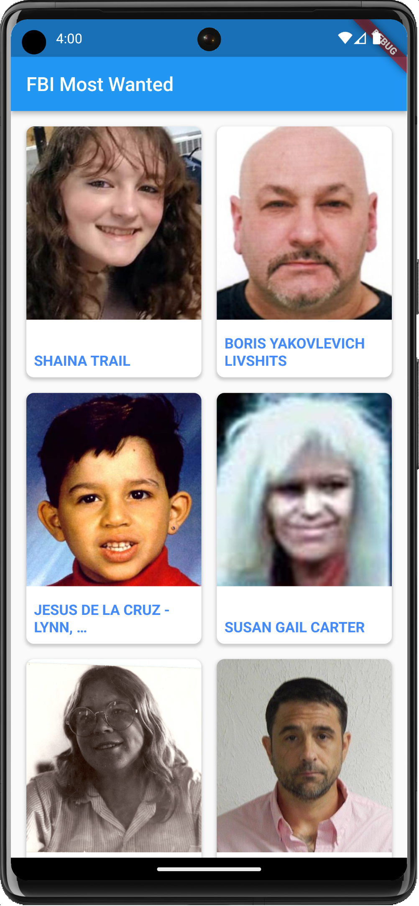
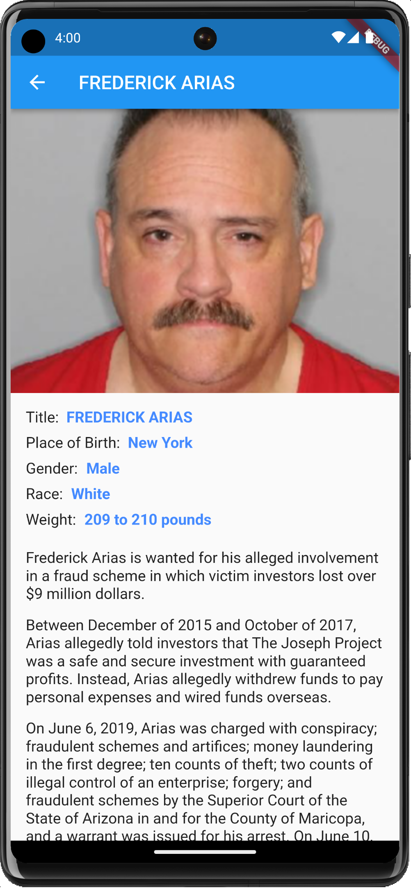

<!-- HEADER -->

<h1>FBI Most Wanted App</h1>

[][iOS]
[][Twitter]
[][Mastodon]

<!-- BODY -->
## Documentation
- [Flutter](https://docs.flutter.dev)
- [Dart](https://dart.dev)

## API
- [FBI Most Wanted API](https://www.fbi.gov/wanted)

## Description
The `FBI Most Wanted App` consumes an API originary from the FBI to present a list of the most wanted criminals in the US. Right after launch it presents a grid with the first 20 criminals, when tapping on anyone of them it shows their respective case details and makes a new fetch automatically when the scroll reaches the end of the page.

This whole project has been entirely build using Dart and Flutter as an attempt to get acquinted with those technologies and add them to my skillset on future projects.

## Preview
Those are the most relevant screenshots of the app.

	
	

<!-- FOOTER -->
<!-- Permanent links -->
[Swift]: https://www.swift.org
[iOS]: https://developer.apple.com/ios/
[Twitter]: https://twitter.com/TomEstelrich
[Mastodon]: https://iosdev.space/@TomEstelrich